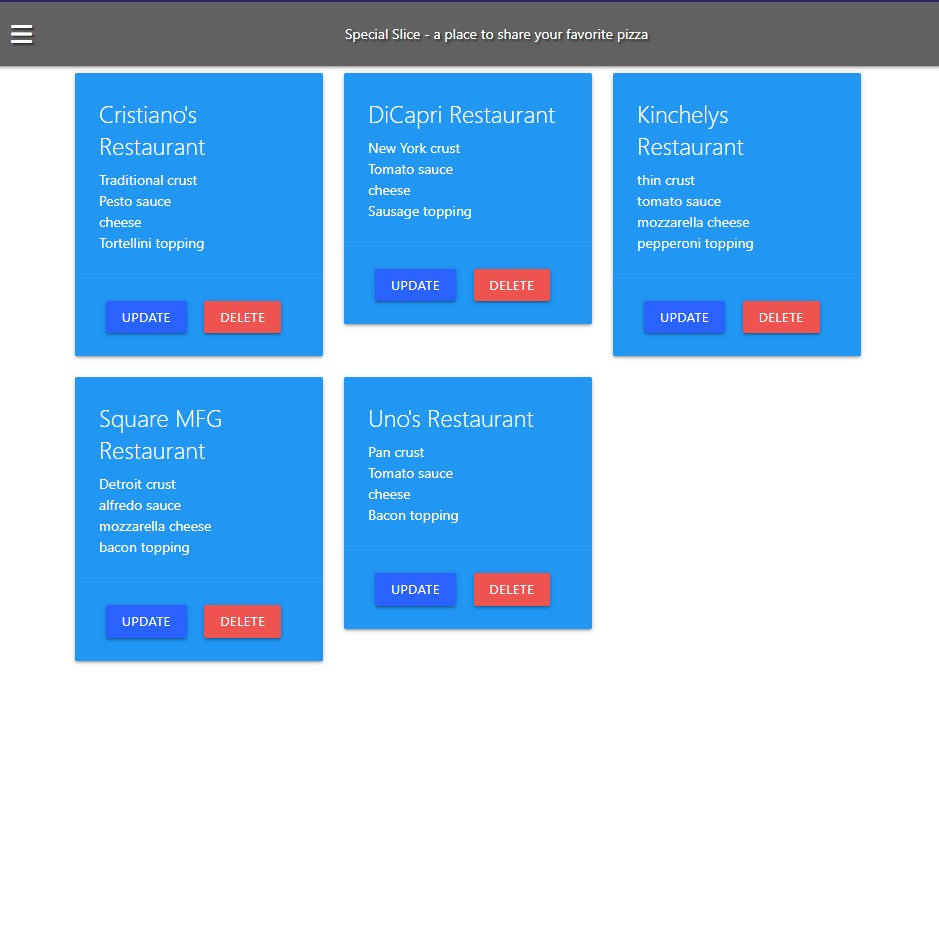
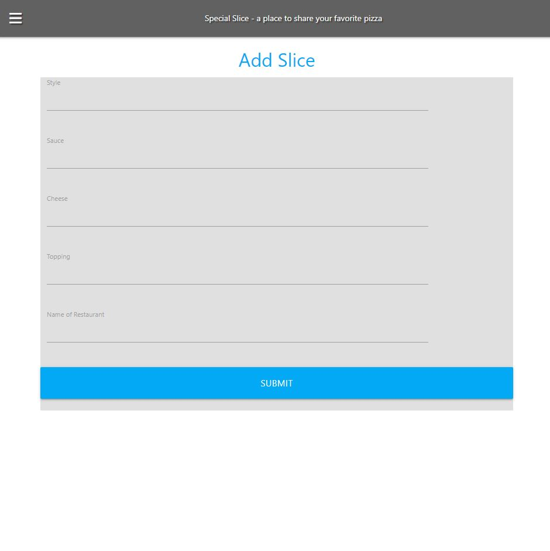
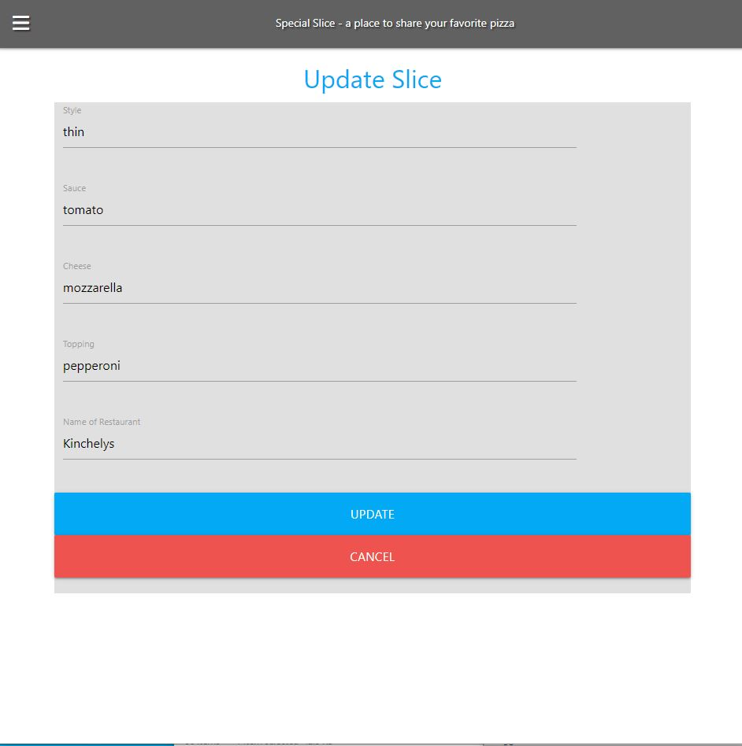

<h1 align="center">Milestone Project 3 - Special Slice - Ant Romano</h1>

[View the live project here.](https://special-slice.herokuapp.com/get_complete_slices)

An interactive matching game site designed using Python, HTML, CSS, JavaScript, Materialize, MongoDB and Heroku to highlight skills learned during Full Stack Software Development coursework.

<h2 align="center"></h2>

## User Experience (UX)

Designed to provide a simple experience for people to share their favorite pizza while highlighting software development skills.

-   ### User stories

    -   #### Pizza Diner

        1. As a Pizza Diner, I want to share my favorite pizza.
        

        2. As a Pizza Diner, I want a simple user interface and functional interactivity.
        
        
        3. As a Pizza Diner, I want a visually appealing experience.
        

-   ### Design
    -   #### Color Scheme
        -   The main colors used are blue, gray, red and white and appropriate shading and highlighting.
    -   #### Typography
        -   Materialize's standard font is the main font used throughout the whole website with Sans Serif as the fallback font               in case for any reason the font isn't being imported into the site correctly.
    -   #### Imagery
        -   Utilized Python, HTML, CSS, JavaScript, Materialize, MongoDB and Heroku.

*   ### Wireframes

    -   The Balsamiq Cloud Wireframe providing framework for development is accessible [here](https://github.com/antfromano/special-slice/blob/main/docs/milestone%20project%203%20balsamiq%20wireframes.pdf)

## Features

-   Responsive on all device sizes

-   Attractive, efficient and interactive elements

## Features Left to Implement/Other Feature Ideas

-   Drop down inputs, insert picture, and insert website address.

## Technologies

### Languages

-   [Python](https://en.wikipedia.org/wiki/Python_(programming_language)
-   [HTML5](https://en.wikipedia.org/wiki/HTML5)
-   [CSS3](https://en.wikipedia.org/wiki/Cascading_Style_Sheets)
-   [JavaScript](https://en.wikipedia.org/wiki/JavaScript)

 and 

### Frameworks, Libraries & Programs

1. [Materialize:](https://materializecss.com/)
    - for structure and layout.
1. [MongoDB:](https://www.mongodb.com/)
    - for database.
1. [Heroku:](https://www.heroku.com/)
    - for deployment.
1. [GitHub:](https://github.com/antfromano/special-slice)
    - as a repository, distributed version-control system for tracking changes and to deploy and host final version of code.
1. [Gitpod:](https://gitpod.io/)
    - as a collaborative development environment.
1. [Balsamiq:](https://balsamiq.com/)
    - Balsamiq was used to create the [wireframes]((https://github.com/antfromano/special-slice/blob/main/docs/milestone%20project%203%20balsamiq%20wireframes.pdf)) during the design process.
    
## Testing

The W3C Markup Validator and W3C CSS Validator Services were used to validate every page of the project to ensure there were no syntax errors in the project.

-   [W3C Markup Validator](https://validator.w3.org/) - [Results]https://github.com/antfromano/special-slice/blob/main/docs/Showing%20results%20for%20https___special-slice.herokuapp.com_get_complete_slices%20-%20Nu%20Html%20Checker.pdf
-   [W3C CSS Validator](https://jigsaw.w3.org/css-validator/) - [Results](https://github.com/antfromano/special-slice/blob/main/img/Capture.JPG)

Lighthouse was also used to validate the project for performance, accessability, best practices and SEO.

-   [Lighthouse](https://developers.google.com/web/tools/lighthouse) - [Desktop Results](https://github.com/antfromano/special-slice/blob/main/docs/lighthouse%20desktop.pdf)

-   [Lighthouse](https://developers.google.com/web/tools/lighthouse) - [Mobile Results](https://github.com/antfromano/special-slice/blob/main/docs/lighthouse%20mobile.pdf)

### Testing User Stories from User Experience (UX)

-   #### Pizza Diner Goals

    1. As a Pizza Diner, I want to share my favorite pizza.

        1. Upon entering the site, diners are greeted with a simple title, several pizza slices and an Add Slice button which allows them to add a slice.
        2. The Add Slice button is immediately noticeable which leads the diner to the appropriate pagae.
        3. The player can input the style, sauce, cheese, topping and name of the restaurant and hit submit to log their entry.
 
    2. As a Pizza Diner, I want a simple user interface and functional interactivity.

        1. The site has been designed to be simple to navigate. 
        2. Each page is layed out evenly and works cleanly when the items are entered and update, delete and submit are clicked.
        3. The Special Slice title allows the diner to home any time they wish.

    3. As a Pizza Diner, I want a visually appealing experience.
        1. The colors and contracts utilized make the text and buttons stand out.
        2. Flash messages confirm when slices are input, updated and deleted.
        3. The colorful combinations and highlights add to the user experience.

### Further Testing

-   Tested on Google Chrome, Internet Explorer and Microsoft Edge.
-   Viewed on variety of devices such as Desktop, Chromebook and Pixel XL.
-   Testing was done to ensure that all pages linked correctly.
-   Friends and family were asked to review site and documentation for any bugs and/or user issues.
-   Attempted to enter blank entries and was unable to.
-   Tested update, delete and submit buttons extensively.

### Known Bugs

-   On some mobile devices the headings aren't fully centered.

## Deployment

### Heroku

Project was deployed to Heroku with the following steps...

1. Log in to Heroku and click the “new” dropdown button on the dashboard and select “create new app”
2. Name your app (the name must be unique) and ensure the correct region has been set for where you are. 
3. Click “create app”.
4. In the terminal in your app type “npm install -g heroku” and hit enter to install Heroku into your app. The “-g” installs Heroku globally across your project. 
5. Log in to Heroku in the terminal by using “Heroku login -I” then input your email address and password for Heroku.

### Forking the GitHub Repository

Forking the GitHub Repository makes an original repository copy on oGitHub account for viewing and/or making changes but not affecting original repository achieve with the following steps.

1. Log in GitHub and locate [GitHub Repository](https://github.com/)
2. At top of Repository, locate "Fork" Button where there is now a copy of original repository.

### Making a Local Clone

1. Log in GitHub and locate [GitHub Repository](https://github.com/)
2. Under repository name, select "Clone or download".
3. For cloning repository using HTTPS copy the link under "Clone with HTTPS".
4. Open Git Bash and modify current working directory to location of your preferred cloned directory.
5. Input `git clone`, and paste copied URL from Step 3.

```
$ git clone https://github.com/antfromano/special-slice
```

6. Press Enter. Local clone is created.

```
$ git clone https://github.com/antfromano/special-slice
> Cloning into `CI-Clone`...
> remote: Counting objects: 10, done.
> remote: Compressing objects: 100% (8/8), done.
> remove: Total 10 (delta 1), reused 10 (delta 1)
> Unpacking objects: 100% (10/10), done.
```

Click [Here](https://help.github.com/en/github/creating-cloning-and-archiving-repositories/cloning-a-repository#cloning-a-repository-to-github-desktop) to retrieve pictures for some of the buttons and more detailed explanations of the above process.

## Credits

### Code

-   [Materialize:](https://materializecss.com/) used to make site responsive.

-   [Mini Project](https://github.com/Code-Institute-Solutions/TaskManagerAuth/tree/main/08-SearchingWithinTheDatabase/01-text_index_searching): Mini Project concepts used to develop match site.

### Content

-   All content was written by the developer.

-   The format for README.md was taken from [here](https://github.com/Code-Institute-Solutions/SampleREADME/blob/master/README.md)


### Acknowledgements

-   Mentorship and guidance provided by Aaron Sinnott from Code Institute

-   Tutor support at Code Institute for their support.

-   I received inspiration for this project from Amyh97(https://github.com/Amyh97)
